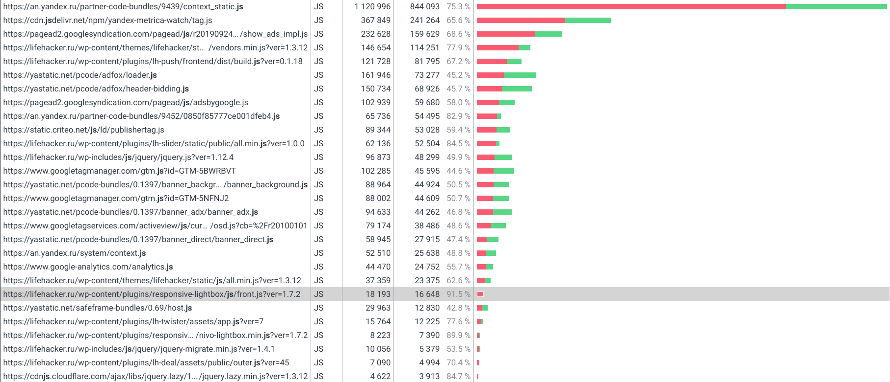

# Основное задание

Сделать анализ загрузки сайта lifehacker.ru в Chrome DevTools по вкладкам Network, Performance, Coverage

## Условия:

- проверить URL https://lifehacker.ru/
- использовать вкладку инкогнито с отключенными расширениями
- на вкладке Network отключить кэш (Disable cache)
- на вкладке Network
    - записать и сохранить в HAR архив профиль загрузки ресурсов при открытии страницы
    -  найти неоптимальные места:
        - дублирование ресурсов
        
        
        
        
        - лишний размер ресурса

        

        суммарно transferred<resources, но видно, что для многих файлов наоборот
        
        
        
        - медленно загружающиеся ресурсы
        
        - ресурсы, блокирующие загрузку
        

- на вкладке Performance
    - записать и сохранить в файл профиль загрузки страницы
    - измерить время в миллисекундах от начала навигации до событий 
        - First Paint - 732ms
        - First Meaningful Paint -1390ms
        - DOM Content Loaded - 2080ms
        - Load - 4967ms
    - измерить, сколько времени в миллисекундах тратится на разные этапы обработки документа (Loading, Scripting, Rendering, Painting)
    

- на вкладке Coverage
    - сохранить скриншот вкладки после загрузки страницы
    
    
    
    - измерить в килобайтах объём неиспользованного CSS в ходе загрузки страницы - 228Kb
    
    - измерить в килобайтах объём неиспользованного JS в ходе загрузки страницы - 2230Kb (2,4Mb-228Kb)
    
